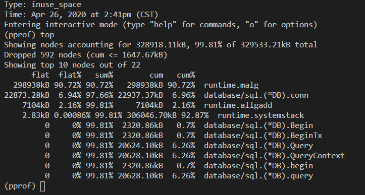

## 添加分析工具

main 函数里添加以下代码

```
_ "net/http/pprof"

go func() {
			http.ListenAndServe("localhost:6060", nil)
		}()
```

## 查看内存使用情况

查看已使用内存情况：

    go tool pprof -inuse_space http://localhost:6060/debug/pprof/heap

