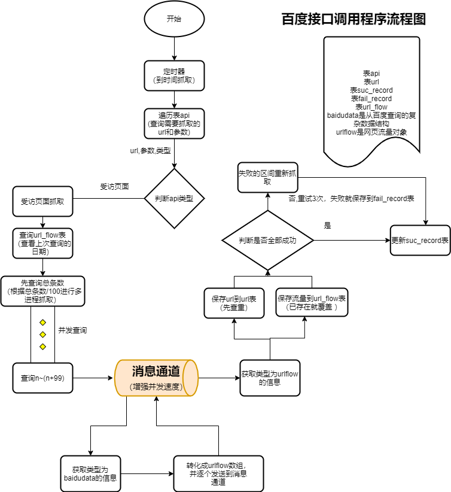

## api查询框架



## 受访页面流量查询

根据百度统计接口从远程拉取数据，参数类型：

```
{"header":{"username":"","password":"","token":"","account_type":1},"body":{"site_id":"","start_date":"20190430","end_date":"20190430","metrics":"","method":"visit/toppage/a","start_index":0,"max_results":10,"source":"","visitor":""}}
```

#### 流量来源 source

"source":"link" 表示外部链接

"source": "search,0" 表示搜索引擎全部

"source":"through" 表示直接访问

#### 访客过滤 visitor

"visitor": "old" 表示老访客

"visitor": "new" 表示新访客


## 查询原理

1.搜索表baidu_api里面的查询句

2.根据查询的语句逐个搜索

3.并标注source和visitor类型

